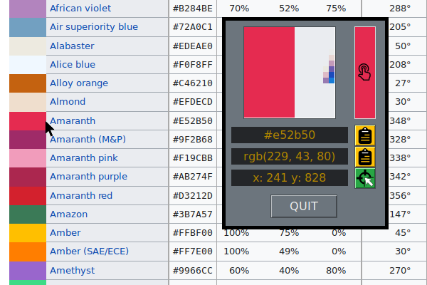

# Color picker

Screen color identifier at mouse point, color chooser.
## Features
- show zoomed area around the mouse
- show color-block filled by color of pixel under the mouse
- show rgb and hex color index of pixel under the mouse
- show mouse coordinates
- change choosen color by clicking on color-block
## Usage
Button with "target" icon, activate main picker function and show zoomed area around the mouse.

After mouse click, main function stops and by default save hex index of the color to clipboard

Click on right color block shows color palette.
